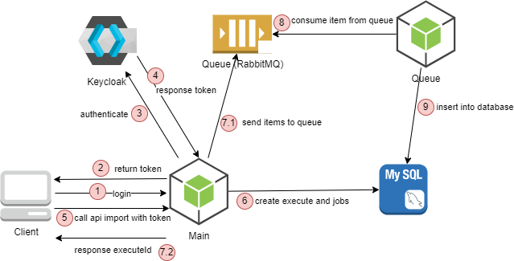

<!--suppress HtmlDeprecatedAttribute -->
<div align="center">
  <h1>Problem statement</h1>
</div>

<p align="center">
<a href="https://snyk.io/test/github/liemlylac/problem-statement" target="_blank"></a>
<a href="https://codeclimate.com/github/liemlylac/problem-statement/test_coverage" target="_blank"></a>
  <a href="https://codeclimate.com/github/liemlylac/problem-statement/maintainability" target="_blank"></a>
  <a href="https://sonarcloud.io/summary/new_code?id=liemlylac_problem-statement" target="_blank"></a>
   <a href="https://sonarcloud.io/summary/new_code?id=liemlylac_problem-statement" target="_blank"></a>
  <a href="https://github.com/liemlylac/problem-statement/blob/main/LICENSE" target="_blank"></a>
 </p>


## Description
Problem statement using NestJs framework.

## Repo structure
Code artifacts as part of a lightweight monorepo, more appropriate for multi-project environments
Ref: [Monorepo - CLI | NestJS - A progressive Node.js framework](https://docs.nestjs.com/cli/monorepo#monorepo-mode)
```
  > apps/
    - main/
      - src/*
      - test/*
      - tsconfig.app.json
    - queue/
      - src/*
      - test/*
      - tsconfig.app.json
  > libs/
    - core/
      - src/*
      - tsconfig.lib.json
  node_modules/*
  package.json
  tsconfig.json
```

## Application flow


## Pre-requirement
- Node.js v14 or later
- Docker
- Docker Compose

## Starting
- Installation
```bash
# problem-statement >
$ npm install
```
- Copy `.env.example` to `.env`

- Running services needed for apps
```bash
# problem-statement >
$ docker-compose up
```

- Running the main app (another terminal)
```bash
# problem-statement >
$ npm run start
```

- Running the queue app (another terminal)
```bash
# problem-statement >
$ npm run start queue
```

### 
- Get token:

```bash
$ curl --location --request POST 'http://localhost:3000/auth/login' \
--header 'Content-Type: application/json' \
--data-raw '{
    "username": "user1",
    "password": "123123"
}'
```
- Start import
```bash
$ curl --location --request POST 'localhost:3000/transaction/import' \
--header 'Authorization: Bearer <xxx.xxx.xxx>' \
--form 'file=@"/path/to/sample-transaction-import-file.xlsx"'
```

- Describe execution
```bash
$ curl --location --request GET 'http://localhost:3000/execution/describe/<execution-id-here>' \
--header 'Authorization: Bearer <xxx.xxx.xxx>'
```


## Test
```bash
# problem-statement >
$ npm run test
```

## License
This repo is [MIT licensed](LICENSE).
