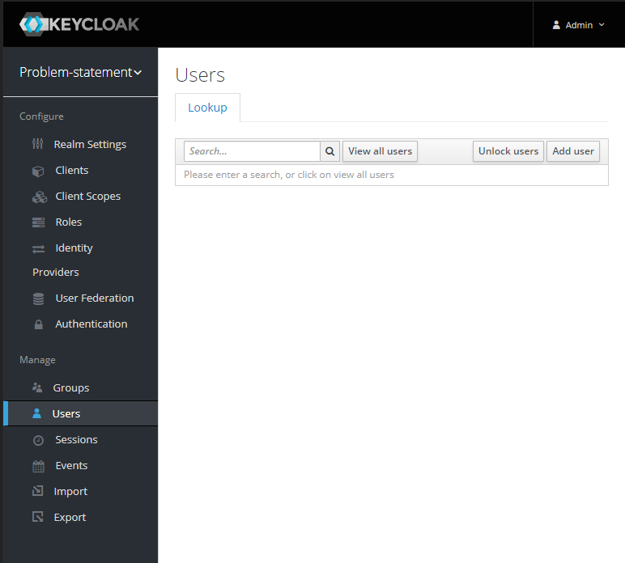
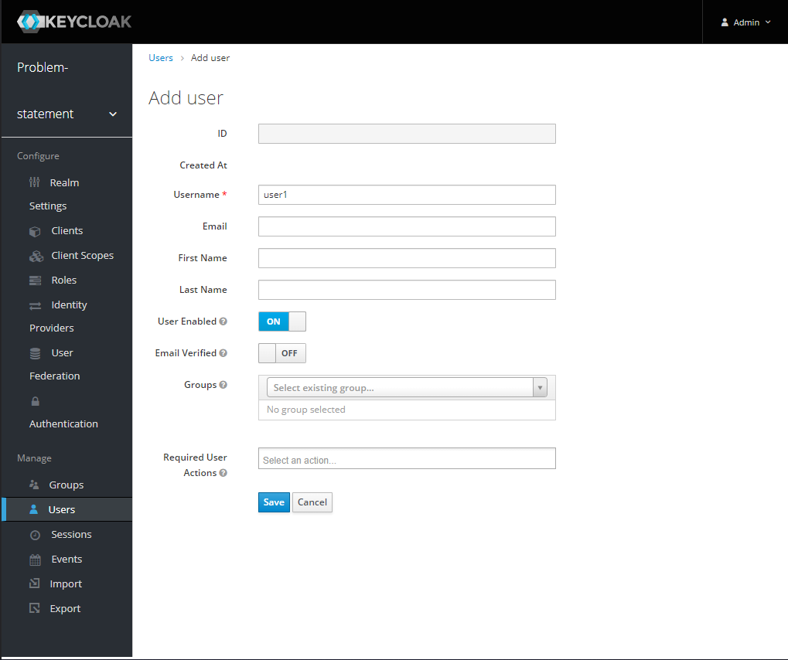
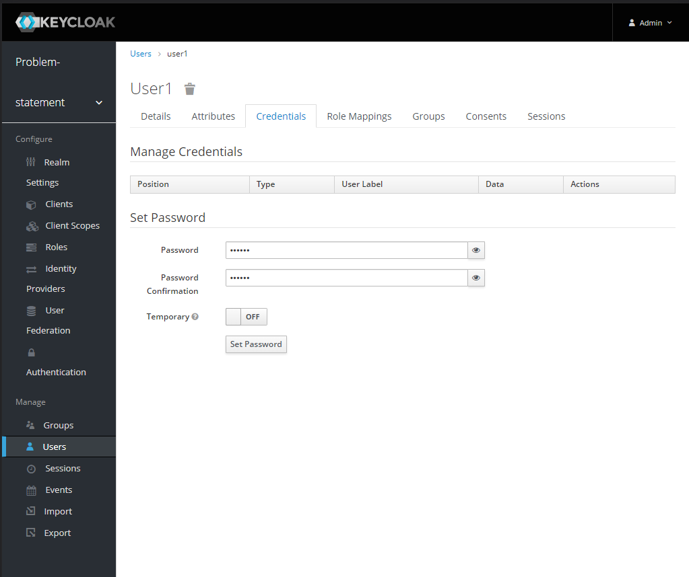
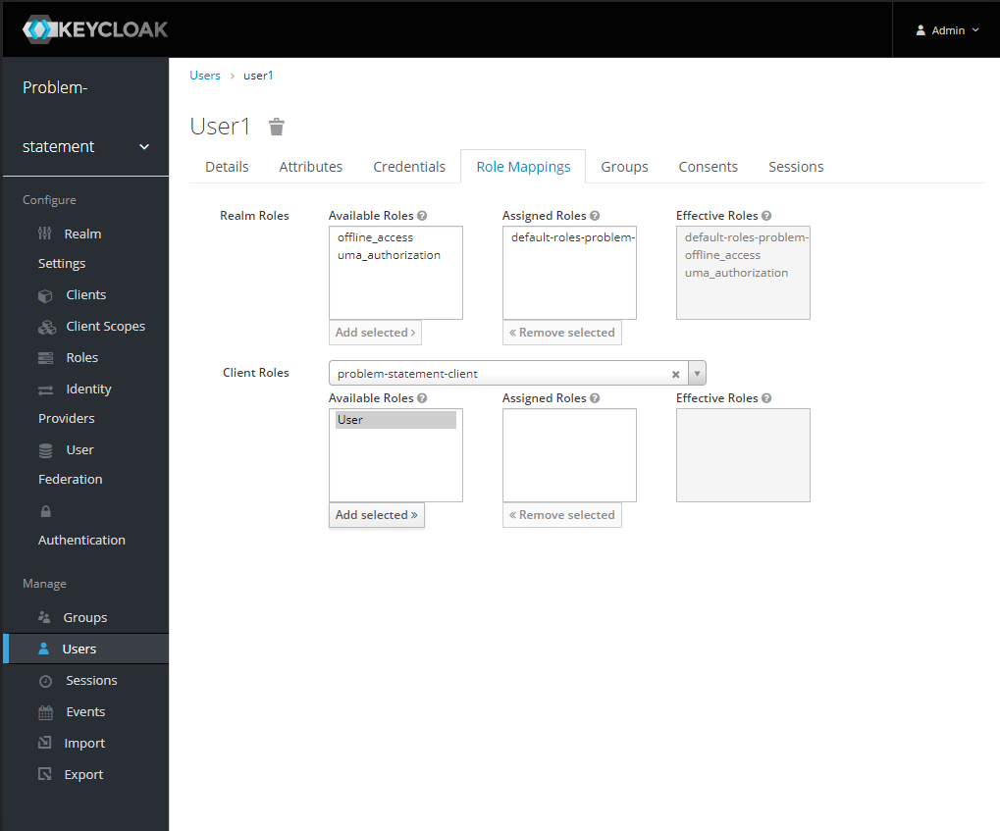

# Keycloak settings

## Client Secret
1. Generate client secret by access [this link](http://localhost:8080/auth/admin/master/console/#/realms/problem-statement/clients/5092315f-01a8-4503-b515-c19730786378/credentials)
2. Using `admin/secret` for username and password
3. Tab: "Credentials", field Secret, click on button **Regenerate Secret**
4. Copy secret and replace value to file `.env` key: `KEYCLOAK_CLIENT_SECRET`

## Create User
1. Access [this link](http://localhost:8080/auth/admin/master/console/#/realms/problem-statement/users)
or go to Manager > User at the left menu.
2. Click add user


3. User info:
   - Username: `user1`
   - another information if you want (optional)
4. Save

## Create password for user
1. Click on user that you have been created.
2. Tabs Credentials: enter new password for user. Example: `123123`
3. Turn of Temporary
4. Click on **Set Password**

5. Confirm Set Password for user

## Assign role to user
1. Tab **Role Mappings** 
2. At Client Roles > choose **problem-statement-client** 
3. Select Available Roles > User
4. Click **Add selected >>**



## Using `curl` for login

```bash
$ curl --location --request POST 'http://localhost:3000/auth/login' \
--header 'Content-Type: application/json' \
--data-raw '{"username": "user1","password": "123123"}'
```
